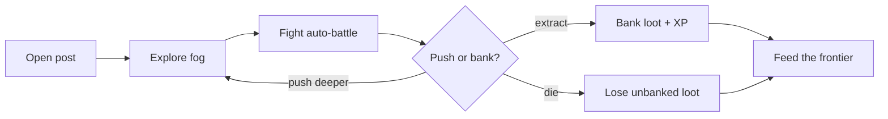

# 00 · The Core Run (foundation)

The atomic gameplay: **what a single delve feels like second-to-second.** The
space you move in, what a "turn" is, the verbs a hero has, and what makes each
moment a *decision*. Fun here first, or nothing above it matters. Detail:
[[turn-model]]. Hub: [[Home]].

## The delve loop

## Decided (see [[turn-model]])

- **Auto-battle** — free-move grid exploration; on engage, basic attacks fire
  automatically. Reflex-light, deterministic (server-verifiable).
- **No movement during a fight** — positioning is a *pre-fight* choice; keeps it
  an auto-battler, not an action game.
- **Verbs** — move (explore only), auto basic-attack, manual **ability**,
  interact, retreat/extract.
- **Pressure** — resource attrition (limited HP, finite mana) forces
  engage/avoid/retreat choices.
- **Terrain bonuses** — high ground etc. modify a fight (set at engage).
- **Extract-or-lose** — bank loot by extracting; death loses unbanked loot, the
  hero persists.

## Feeds

- **Client (GameMaker):** the model + verbs define input & feel — see
  [[ARCHITECTURE]].
- **Server (TS):** the deterministic fight defines the anti-cheat contract.
- **[[combat]]** builds directly on this; [[classes]] and [[monsters]] plug in.

## Related
[[turn-model]] · [[classes]] · [[monsters]] · [[combat]] · [[ARCHITECTURE]]
