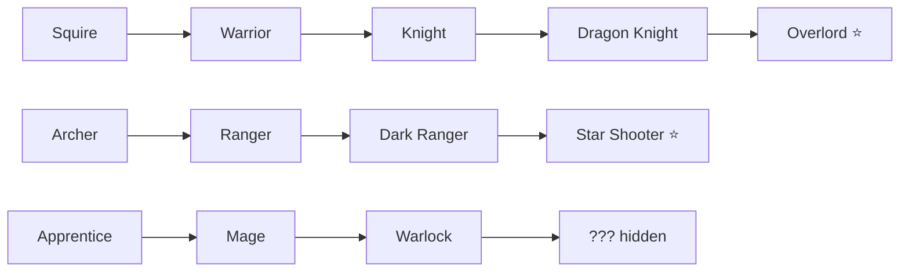

# 01 · Classes

What you **pick at the start** and what makes each archetype distinct — plus how
it **advances** into deeper specializations. Defines the *shapes* [[combat]]
must support, so it comes before combat. Detail: [[advancement]]. Hub: [[Home]].

## Structure — an advancement tree  ✅

- Pick a **base class** (tier 0): **Squire / Archer / Apprentice**.
- Delve + level → **advancement points** where the tree **branches**; choose and
  commit. Locked once you branch unless a node branches further.
- Climb to a **capstone**; maxing it = that path is **Mastered** and banked to
  your account **roster**.
- **Per-hero journey is committed** (identity + meaningful choice); the
  **account roster** of Masteries grows forever. Both, at different levels.

### Example trees (illustrative)

### Hidden branches
Unlisted advancements — no in-game hints. The subreddit discovers the triggers
and shares them (Reddit-native discovery). Slot into the tree as hidden nodes.

## Base trio (tier-0 identity — react/expand)

| Class | Fantasy | Role | Attack |
|---|---|---|---|
| Squire→Warrior | frontline bruiser | tanky, sustain | melee, adjacent |
| Archer→Ranger | precise hunter | single-target | ranged, opening window |
| Apprentice→Mage | arcane force | group damage | magic, hits the pull |

## Decisions — ✅ (detail in [[advancement]])

Roster payoff = **B + D** (prestige badge + unlock as a new base pick);
advancement = a **ritual** (level → hinted items → craft key → class temple →
trial boss); hero is **permanent** across seasons; **1 free respec**, then a rare
item to step back one node.

## Resource model — ✅ unified MANA

All classes use **mana**, with a **per-class base pool + regen** so they play
differently (Mage: big/slow/burst · Ranger: small/fast/cheap · Warrior: medium,
may gain mana by attacking). Optional per-class name reskin. The **abilities**
carry most of the class feel — designed with [[combat]].

## Still open
- **Per-class ability kits** — coupled to the [[combat]] number system, then
  written back here per class.
- Progression numbers (XP/levels/prestige) get their own folder after [[combat]]
  + [[loot-gear]].

## Related
[[core-run]] · [[advancement]] · [[combat]] · [[monsters]] · [[loot-gear]]
