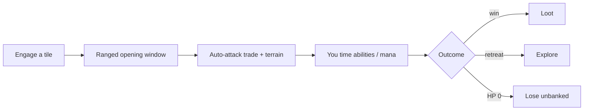

# 03 · Combat

Stationary auto-battle from [[core-run]], resolving [[classes]] vs [[monsters]].

## Fight flow

## Decided ✅
- **Damage feel:** variance + crits. `hit = Attack × (1 − Defense%)` with small
  **seeded** variance (±10%) + low crit (~5% → ×1.5). Deterministic → server
  re-sims.
- **Abilities:** a **fixed 5 active slots + 4 passive slots**, **unlocked as you
  level** ([[hero-progression]]). Actives cost mana + cooldown. (Start at 5/4;
  can raise later.)
- **Retreat:** allowed, but **turning your back exposes you** — monsters may
  land a parting hit as you disengage.

## Proposed (still open)
- **Stats.** Hero: HP · Attack · Defense% · Attack-Speed · Mana · Mana-regen.
  Monster: HP · Attack · light Defense · **1 signature move**.
- **Cadence.** Melee = fast, must be adjacent; ranged/mage = slower, hit from
  the **opening window** (~1–2 free volleys before the melee trade).
- **Terrain bonus.** High ground = damage/defense boost (size TBD — see
  [[FINALIZE]] #6). Reuses the Faction War terrain concept.
- **Bosses.** Big HP, 2–3 signature moves, **phases** at HP thresholds — all
  resolved in the auto-battle (**it's an auto-battler; no reaction-telegraphs**).
  You counter a boss with your build, terrain, ability timing, and the
  retreat/extract decision — not by reacting to a wind-up.

## ❓ To finalize
- Terrain bonus size + which terrains beyond high ground (#6).
- Per-class starting kits (Warrior/Ranger/Mage) — #9, deferred by you.

## Related
[[core-run]] · [[classes]] · [[monsters]] · [[loot-gear]] · [[hero-progression]]
