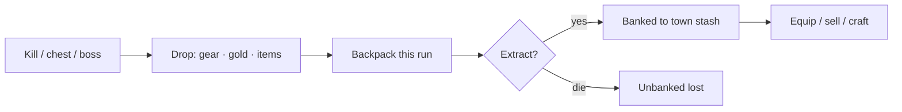

# 04 · Loot & Gear

What drops, what you equip, what you risk. Feeds [[combat]] stats; ties to the
[[advancement]] ritual.

## Flow

## Decided ✅
- **9 gear slots:** Head · Body · Hand ×2 · Legs · Feet · Ring ×2 · Amulet.
- **5 rarity tiers:** Common → Uncommon → Rare → Epic → Legendary (higher =
  better stats + more affixes: crit, terrain bonus, +ability, class perks).
- **Stakes:** equipped gear is **always safe**; only loot found this run and
  **not yet extracted** is lost on death.
- **Backpack = 35 slots** this run (v1, adjustable); unlimited **town stash**.

## Proposed (still open)
- **Sources.** Monster drops, delve chests, boss drops, town shop (gold).
- **Class restriction.** Weapons role-locked (staff/bow/sword); armour +
  trinkets universal.
- **Crafting (v1 = minimal).** Only the [[advancement]] **key** recipe from
  hinted quest items; general crafting deferred.
- **Advancement items** — a quest-item category with in-world **hints**, found
  in delves, feeding the promotion ritual.

## ❓ To finalize
- Is **gold** the only currency, or add crafting mats / a prestige currency?
- Does the backpack upgrade over time, or stay 35?
- Dual-wield vs weapon+off-hand for the two Hand slots?

## Related
[[classes]] · [[combat]] · [[advancement]] · [[economy]]
