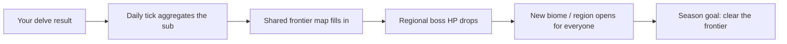

# 06 · The Frontier (community meta)

The shared layer — "solo in the small, together in the large." Every solo
[[delve-generation|delve]] feeds one community goal. Proposals for review
([[FINALIZE]]).

## Flow

## Proposed

- **The objective.** A season-long shared **frontier map** the sub uncovers
  together: explore regions → chip **regional boss** HP → felling a boss
  **opens the next biome** for everyone (Meadow → Forest → Swamp → …).
- **Contribution.** Each delve's results (tiles explored, boss damage, resources)
  roll up via the scheduler tick into shared progress.
- **What the sub sees.** The frontier map with its progress, a **regional boss
  HP bar**, and a **contributor leaderboard** (co-op flavored, not PvP).
- **Season.** ✅ **4 weeks.** End = did the sub clear the frontier? Ceremony +
  rewards + a fresh frontier. Hero persists; frontier resets.
- **Sharding.** A sub too big for one frontier → parallel frontiers (the old
  "theater" concept).
- **Scope.** v1 = each sub has its own co-op frontier. Cross-sub rivalry later.

## Decided ✅ (2026-07-14)
- Season = **4 weeks**. **Win = defeat the frontier's big boss.**
- **Fail (boss not beaten in time):** the threat grows — next boss is
  **stronger, with reduced/no drop rewards** (soft-loss penalty).
- **Contributor leaderboard shown** (co-op, but the competition is visible).

## ❓ To finalize
- Exact fail penalty (how much stronger / how much reward cut).
- Does the [[delve-generation|Daily Delve]] feed the frontier, or is it its own
  leaderboard?

## Related
[[delve-generation]] · [[reddit-native]] · [[economy]] · [[CORE_LOOP]]
