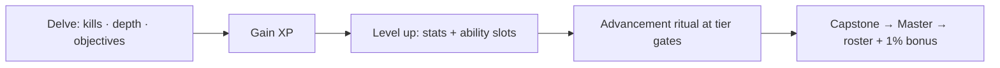

# 10 · Hero Progression

XP, levels, prestige — it scales [[combat]] numbers, so it's designed after
combat + [[loot-gear]].

## Flow

## Decided ✅ (2026-07-14)
- **Level cap = 100.** XP per level **rises each level** (steeper curve as you
  climb). Exact XP weighting (kills vs depth vs objectives) **tuned by testing.**
- **Leveling unlocks the 5 active + 4 passive** ability slots over time
  (from [[combat]]).
- **Prestige bonus:** mastering a capstone grants a **small permanent stat
  bonus** (~**1%** HP/Attack/etc **per mastery**) on top of the roster
  badge + new-base-pick ([[advancement]]).

> ⚠️ **Balance flag:** the 1% prestige bonus stacks across masteries, so
> veterans get permanently stronger. That's fine for co-op, but it skews the
> **Daily Delve leaderboard** (high-prestige accounts rank higher). Guard it —
> e.g. cap total prestige %, or bracket/normalize the leaderboard. → [[FINALIZE]].

## Proposed (still open)
- **Advancement gates within the 100:** you must **promote** (the [[advancement]]
  ritual) at tier thresholds to keep leveling toward 100 — welds leveling to the
  class tree.
- **Death** costs no levels (hero persists); only unbanked run loot is lost.

## ❓ To finalize
- How the 100 levels split across advancement tiers (even? front/back-loaded?).
- Prestige-bonus cap + leaderboard fairness (see flag above).

## Related
[[classes]] · [[advancement]] · [[combat]] · [[loot-gear]]
