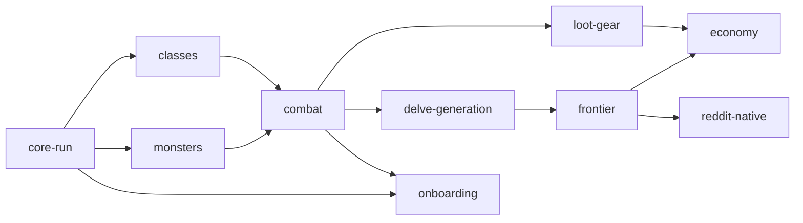

# Mechanics — index & tracker

Each mechanic = its own folder with a primary note + topic pages. We design in
dependency order: a mechanic is drafted only once the ones it stands on are
settled. Every decision passes the kill-test (motivation row + persona + loop +
anecdote — see the Faction War blueprint). Hub: [[Home]].

## The stack at a glance

> Visual board: open [[Design-Map.canvas|🗺️ Design Map]].

## Design order (foundation → wrappers)

| # | Mechanic | Sits on | Status |
|---|----------|---------|--------|
| 00 | [[core-run]] — space · turn · verbs | (bedrock) | ✅ locked |
| 01 | [[classes]] — trees, roster, advancement | [[core-run]] | ✅ locked |
| 02 | [[monsters]] — the enemy cast | [[core-run]], [[classes]] | ✅ locked |
| 03 | [[combat]] | 00–02 | 📝 planned |
| 04 | [[loot-gear]] | [[combat]] | 📝 planned |
| 05 | [[delve-generation]] | [[combat]] | 📝 planned |
| 06 | [[frontier]] — community meta | 00–05 | 📝 planned |
| 07 | [[economy]] & monetization | [[loot-gear]], [[frontier]] | 📝 planned |
| 08 | [[onboarding]] | [[combat]] | 📝 planned |
| 09 | [[reddit-native]] | [[frontier]] | 📝 planned |
| 10 | [[hero-progression]] — XP/levels/prestige | [[combat]], [[loot-gear]] | 📝 planned |

**📝 planned = proposals written, awaiting your call → [[FINALIZE]].**

## Why this order

[[core-run]] is bedrock: if a single delve isn't fun with one enemy and no loot,
nothing above it saves the game. Classes define the *shapes* combat must
support, monsters define *who* it fights, so both precede [[combat]]. Loot and
generation build on combat; [[frontier]] aggregates what runs produce;
economy / onboarding / [[reddit-native]] wrap the whole thing.

## How we work each folder

1. Open its primary note — purpose, what it must decide, dependencies.
2. Draft topic pages, capturing options → recommendation → decision.
3. Run each decision through the kill-test.
4. Flip status and move up the stack.
